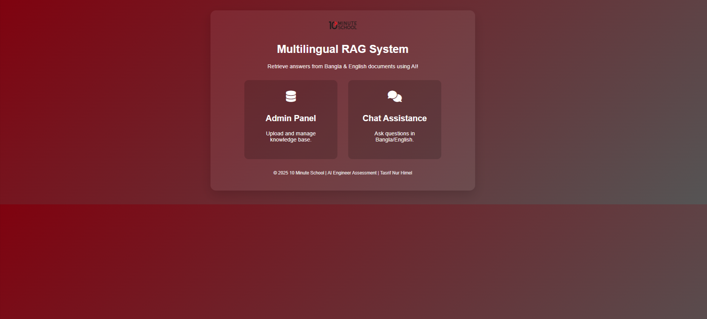
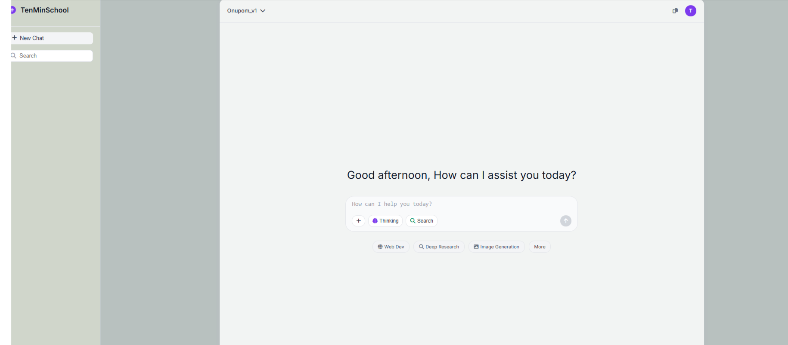
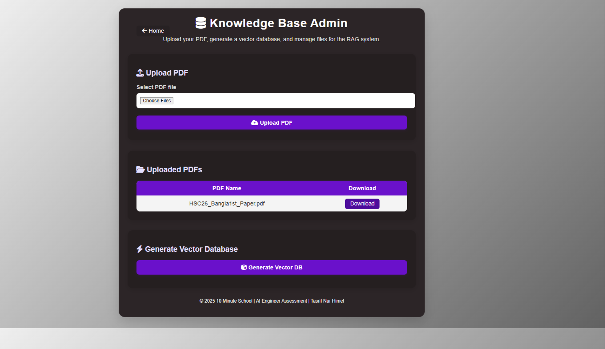
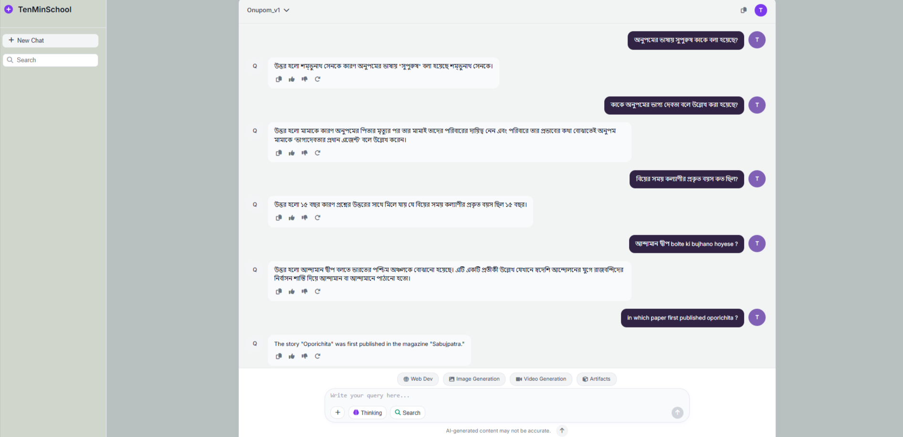

# Simple Multilingual RAG — Setup & Usage Guidelines

Welcome to the **Simple Multilingual RAG** project! This document provides a comprehensive guide for HR, reviewers, or engineers to understand, run, and evaluate the system as per the technical assessment from Ten Minute School.


---

## 1. **Project Structure Overview**

```
Simple-Multilingual-RAG/
│
├── main.py                  # Core FastAPI backend (REST API, RAG logic, chat)
├── test.py                  # Text extraction & chunking debugger (outputs raw/chunked text)
├── mcq_data.json            # MCQ questions/options/answers as structured data for extra reasoning
├── .env                     # Environment variables/settings (OpenAI key, etc.)
│
├── vectorstore/
│   └── vec_db/
│       ├── index.faiss      # FAISS vector index (vectorized chunks for retrieval)
│       └── index.pkl        # Mapping and metadata for chunk-to-original-text mapping
│
├── data/
│   └── uploaded_pdfs/       # Uploaded source PDFs (original, not directly used at runtime)
│
├── debug_outputs/           # Created by test.py: extracted raw and chunked text for inspection
│
├── templates/               # HTML templates for web frontend (chat, admin, index)
│   ├── index.html
│   ├── admin.html
│   └── chat.html
│
├── static/                  # Static files for the frontend UI
│   ├── styles/
│   │   ├── index.css
│   │   ├── admin.css
│   │   └── chat.css
│   ├── js/
│   │   ├── admin.js
│   │   └── chat.js
│   └── images/
│       └── 10_Minute_School_Logo.svg.png
│
├── requirements.txt         # All required Python packages/libraries
└── README.md                # Main documentation (to be created after this guidelines doc)
```

---

## 2. **Folder and File Clarification**

- **main.py**: The main backend application (FastAPI). Implements REST API endpoints for chat, PDF management, and vector DB.
- **test.py**: Utility for debugging text extraction and chunking. Outputs `.txt` files to `debug_outputs/` for QA.
- **mcq_data.json**: JSON with MCQ questions/options/answers for more accurate MCQ handling.
- **.env**: Store your API keys and settings (not uploaded for security).
- **vectorstore/vec_db/index.faiss**: The FAISS vector index file, used for fast semantic search of document chunks.
- **vectorstore/vec_db/index.pkl**: Python pickle file mapping chunk IDs to their original text and metadata (for context retrieval).
- **data/uploaded_pdfs/**: Stores uploaded PDF files (raw, not required at runtime if vector DB exists).
- **debug_outputs/**: Where `test.py` saves extracted and chunked text for inspection/debugging.
- **templates/**: Contains all HTML files for the web interface (no external frameworks like Gradio/Streamlit used).
- **static/**: Contains styles, JavaScript, and images for the web UI.
- **requirements.txt**: All dependencies (see below for details).
- **README.md**: Main project documentation—setup, sample queries, answers, evaluation, and Q&A.

---

## 3. **Environment & Requirements**

- **Python version:** `3.12.x` (where x = any micro version of Python 3.12)
- **Install dependencies:** All necessary packages are listed in `requirements.txt`.

---

## 4. **Setup & Running the System**

### **A. Clone the Repository**
```sh
git clone https://github.com/Himel-Tasrif/Simple-Multilingual-RAG.git
cd Simple-Multilingual-RAG
```

### **B. Create and Activate a Virtual Environment**
```sh
python3.12 -m venv tenminschool
```
```sh
# Activate on Linux/Mac
source tenminschool/bin/activate
```
```sh
# Activate on Windows
tenminschool\Scripts\activate
```
```sh
# Windows Gitbash
source tenminschool/Scripts/activate
```

### **C. Install Python Dependencies**
```sh
pip install -r requirements.txt
```

### **D. Environment Variables**
To use this project, you need an OpenAI API key to access GPT-4o and embeddings.
- Create a `.env` file with your OpenAI API key and any other required settings. Example:
  ```
  OPENAI_API_KEY=sk-...
  ```
#### - **How to Get and Use an OpenAI API Key**
#### - **Step-by-Step OpenAI API Key Purchase/Setup**

#### **A. Sign Up / Sign In**
1. Go to the official OpenAI website: [https://platform.openai.com/](https://platform.openai.com/)
2. Click **Sign Up** to create an account, or **Sign In** if you already have one.

#### **B. Add Billing / Payment**
1. After login, click Start Building icon (top right) and do all formalities. (If you already have then just go to Billing section)
2. Go to the **Billing** section.
3. Add a payment method (credit/debit card or other supported options).
4. Complete any required verification.
5. Once payment is set up, you can purchase OpenAI API credits or set up a usage-based plan.

#### **C. Create an API Key**
1. In the OpenAI dashboard, click on your profile (top right) and select **View API Keys** or go to [https://platform.openai.com/api-keys](https://platform.openai.com/api-keys).
2. Click **Create new secret key**.
3. Give your key a name (e.g., "test01").
4. Copy the generated API key **immediately** (it will not be shown again).

#### **D. Use the API Key in this Project**
1. Create a file named `.env` in the root of your project if it doesn’t exist.
2. Add your key like this:
    ```
    OPENAI_API_KEY=sk-......................................
    ```
3. **Never share your API key publicly.** Treat it like a password.

---


### **E. Vectorstore/Knowledge Base**
- **No need to create a new vector DB or upload PDFs:**  
  The `vectorstore/vec_db/` folder already contains a pre-built FAISS index (`index.faiss`, `index.pkl`).  
  You can start chatting immediately.

### **F. Run the Application**
```sh
uvicorn main:app --port 8002 --reload
```
- This will start the FastAPI server (default: `http://127.0.0.1:8002`).

### **G. Access the Chat Interface**
- Open your browser and go to:  
  `http://127.0.0.1:8002/chat`

- Guide :
        Click on http://127.0.0.1:8002   (It Open Home Page)


        1. You don’t need deal with vectorDB as i already created your can see those inside vectorstore/vec_db folder


        2. From Homepage click in Chat Assistance   (It will open chat interface http://127.0.0.1:8002/chat)


        3. Type question in Bangla or English (or Banglish)


        4. Get reasoning-based answer (AI reads story context, explains, picks correct answer)


---

## 5. **Frontend**

- Custom HTML/CSS/JS frontend (no Gradio/Streamlit/Chainlit, as these are not designed for production).
- Chat interface is responsive and supports Bangla/English queries.
- All assets are in `templates/` and `static/`.

#### Demo Screenshots

| Chat Interface |
|  | 

| Admin Panle (Knowledge Base) |
|  |

---

## 6. **REST API**

- **/api/chat** (POST): Accepts user queries and chat history, returns model-generated responses (streamed).
- **/api/vector_db_status** (GET): Shows if the vector DB is ready.
- **Admin endpoints:** For PDF upload, listing, download, and vector DB creation (not needed for normal usage).

**Why REST API?**  
- Industry-standard for scalable, secure, production-ready services.
- Decouples backend and frontend (any client can use your API).
- Enables Ten Minute School to integrate with their platform, mobile app, or other tools.

**API Documentation (REST Endpoints)**

- **Base URL**

```
http://127.0.0.1:8002/
```

- **Endpoints**

#### **1. `/api/chat` — Main Chat Endpoint**

- **Method:** POST
- **Description:** Accepts chat history and user query, returns model-generated answer (streamed).
- **Request Example:**
    ```json
    {
      "history": [
        {"role": "user", "content": "অনুপমের ভাষায় সুপুরুষ কাকে বলা হয়েছে?"}
      ]
    }
    ```
- **Response:** (streamed text)
    ```
    শুম্ভুনাথ
    ```

#### **2. `/api/vector_db_status` — Vector DB Ready Check**

- **Method:** GET
- **Description:** Returns JSON indicating whether the vector database is present and ready.
- **Response:**
    ```json
    { "exists": true }
    ```

#### **3. **Admin Endpoints (for development/maintenance)**
- `/admin/upload_pdf/` — Upload (multiple) PDFs for knowledge base (POST, multipart).
- `/admin/list_pdfs/` — List all uploaded PDFs (GET).
- `/admin/download_pdf/?filename=...` — Download a specific PDF (GET).
- `/admin/generate_vector_db/` — (Re)generate the vector database from uploaded PDFs (POST).

**Note:** For normal users, admin endpoints are not needed—vector DB is pre-built.

---

## 7. **Vectorstore Details**

- **index.faiss:** Contains the semantic embeddings of all document chunks, enabling fast nearest-neighbor search.
- **index.pkl:** Stores metadata mapping the FAISS vectors back to the original chunk text, so the system can reconstruct the original context for each retrieval.

---

## 8. **Debugging Extraction & Chunking**

- Run `python test.py` to create/debug extracted text and chunked outputs in `debug_outputs/`.
- This is for developers to inspect quality of extraction/chunking—**not needed for normal usage**.

---

## 9. **Sample Video References and Output**

- [Text extraction challenges & solution (video)](https://drive.google.com/file/d/1cDfPEe-1R2SKpLhLnrjoydYknayfWKGT/view?usp=sharing)
- [ Frontend and debugging (video)](https://drive.google.com/file/d/1Pk2J8W8jopMIysaVnyqN5c8D5Ug3ycNa/view?usp=sharing) 
- [REST API & Live query and answering demo (video)](https://drive.google.com/file/d/1FGCQDhv9X11UlWrxfberO68R2-ACBWEm/view?usp=sharing)

#### Output:


---

## 10. **Assessment Q&A**

**Q1. What method or library did you use to extract text, and why? Did you face any formatting challenges with the PDF content?**  
- Used `langchain_community.document_loaders.PyMuPDFLoader` for robust text extraction (handles Bangla PDF well).
- Faced some challenges with formatting (Bangla ligatures, line breaks, MCQ formatting).  
- Solved by reviewing extracted text using `test.py` and adjusting pre-processing.

**Q2. What chunking strategy did you choose? Why?**  
- Used `RecursiveCharacterTextSplitter` (character-based, chunk_size=500, overlap=100).
- Works well for semantic retrieval because it balances context size and retrieval precision, and preserves story/MCQ context.

**Q3. What embedding model did you use? Why?**  
- Used `OpenAIEmbeddings` (`text-embedding-3-large`), for high multilingual support and best-in-class semantic understanding for both Bangla and English.

**Q4. How are you comparing the query with your stored chunks? Why this method?**  
- Hybrid retrieval: BM25 (sparse lexical) + FAISS (dense semantic).
- FAISS enables semantic similarity, BM25 ensures keyword/option matching (crucial for MCQ and Bangla variations).
- This hybrid ensures both relevance and coverage.

**Q5. How do you ensure meaningful comparison? What about vague/missing context?**  
- By using both recent chat history (short-term memory) and document vectorstore (long-term memory).
- If the query is vague, semantic retrieval plus MCQ reference still often finds relevant context; if not, the model says it cannot answer.

**Q6. Are results relevant? What could improve them?**  
- Most results are highly relevant (see sample outputs in README).
- Further improvement: more advanced chunking (sentence/paragraph), better embedding models, or a larger knowledge base.

---
## 10. **Portfolio**

For more of my work, projects, and AI experience, please visit my [portfolio](https://www.tasrifnurhimel.me) and explore further!

---

## 12. **Contact**

For further queries, collaboration, or to see more of my work, please visit my [GitHub](https://github.com/Himel-Tasrif) or my [portfolio](https://www.tasrifnurhimel.me).

---

## Licence & Credits
All rights reserved by ©[Tasrif Nur Himel](https://www.tasrifnurhimel.me)
**Thank you for reviewing my assessment!**